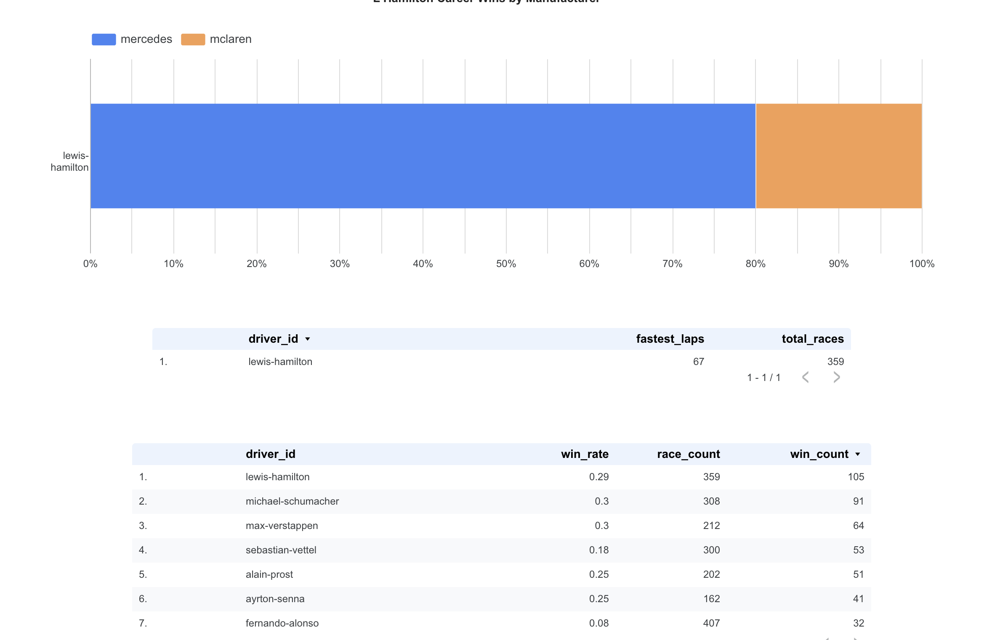

# lewis-hamilton-brilliance
Data Engineering Zoomcamp Capstone Project: The Brilliance of Lewis Hamilton in data

# Problem
#### The Brilliance of Lewis Hamilton
Lewis Hamilton isn’t just a Formula 1 driver—he’s a once-in-a-generation athlete whose dominance has redefined greatness in the sport. With seven world championships, a record-breaking number of wins, poles, and podiums, his career is a data-rich case study in sustained excellence.

But the narrative around "the greatest of all time" in F1 is often subjective—tied up in eras, team dynamics, or fan loyalty. This project sets out to explore that question through data. Using the open [F1DB dataset](https://github.com/f1db/f1db), we’ll build a cloud-based data pipeline that ingests, transforms, and visualizes Hamilton’s career in context with the rest of the grid—past and present.

We’re not here just to admire the stats—we’re here to prove the brilliance with data. Some of the questions we’ll explore:

1. How many races has Lewis Hamilton competed in—and how does his win rate compare to other drivers with long careers?

1. How dominant has he been at certain circuits?

1. How often has he started from pole or the front row?

1. In how many seasons did he win the championship, and how large were the point gaps?

1. How many unique Grands Prix has he won?

1. How many wins did he earn for each manufacturer?

1. Which countries or continents has he dominated most?

1. Who are the all-time greats in terms of total wins, poles, and championships—and where does Lewis stand?

If you're following along we’ll be using GCP, Terraform, BigQuery, dbt, and Looker to create a fully orchestrated pipeline that answers these questions at scale—and makes the case for Lewis Hamilton as the

# Running the Project End-to-End
My project builds a data pipeline around Lewis Hamilton’s career using Terraform, GCP, dbt, and Looker and then orchestrated via Click.

#### Prerequisites
- Google Cloud Project with:
   - Compute Engine virtual machine
   - BigQuery enabled
   - GCS bucket created (used as the raw data lake)
   - Service Account JSON keys 
      - BigQuery Admin, BigQuery Data Editor, BigQuery User, Compute Admin, Project IAM Admin, Storage Admin, Storage Object Admin

- A `.env` file in the project root

- Terraform installed (used to provision BigQuery datasets and GCS buckets)

- A python virtual environment

### Setp 0: Project setup
This project assumes you can ssh into a remote machine at GCP, and that you in your remote environment you already have Terraform, Docker, an Anaconda3 installed. 

- Open your terminal
- Git clone the repo:
   ```bash
   git clone git@github.com:brukeg/lewis-hamilton-brilliance.git
   ```
- Change directory into the project:
   ```bash
   cd lewis-hamilton-brilliance/
   ```
- Create a python virutal environment:
   ```bash
   (base) you@de-zoomcamp:~/lewis-hamilton-brilliance$ python -m venv lewis
   (base) you@de-zoomcamp:~/lewis-hamilton-brilliance$ source lewis/bin/activate
   (lewis) (base) you@de-zoomcamp:~/lewis-hamilton-brilliance$ pip install -r requirements.txt
   ```

- Create a `.env` file at the project root:
   ```bash
   (lewis) (base) you@de-zoomcamp:~/lewis-hamilton-brilliance$ touch .env
   ```

- Now open your `.env` file in any editor and save these details:

   ```
   GOOGLE_CREDENTIALS_HOST=/path/to/your/gcp/service_account_keys.json
   GOOGLE_APPLICATION_CREDENTIALS=/secrets/creds.json
   F1DB_RELEASE_URL=https://github.com/f1db/f1db/releases/download/v2025.3.0/f1db-csv.zip
   RAW_DATA_DIR=/app/data/raw
   GCS_BUCKET=your-gcp-bucket-name-data-lake # details below
   GCS_PREFIX=raw/latest
   ```

**NOTE:**
You'll get the GCS_BUCKET value after you apply terraform changes below. 

- Initiate Docker:
   ```bash
   (lewis) (base) you@de-zoomcamp:~/lewis-hamilton-brilliance$ docker compose up -d --build
   ```

### Step 1: Provision Infrastructure with Terraform
From the root of the repo:

```bash
cd terraform
terraform init
terraform plan
terraform apply
```

**This creates:**
- A GCS bucket for the data lake. You can copy/paste the name of this bucket from the GCP console to your `.env` file GCS_BUCKET variable.
- BigQuery datasets: dbt_staging, semi_processed, final_processed

### Step 2: Ingest Raw Data
From the project root you have two choies. Run the whole project at once or do it in stages/steps further detailed below:

All in one go (ignore following steps):
```bash
python main.py run-pipeline
```

In stages: 
```bash
python cli.py ingest
```

This will:
- Download the latest F1DB dataset
- Extract all CSVs
- Upload them to the GCS bucket in the raw/latest/ folder

### Step 3: Transform with dbt
Run transformations in three stages:

```bash
# Materialize external + raw tables
python cli.py transform --target dev

# Build intermediate tables
python cli.py transform --target semi

# Build final, filtered Lewis Hamilton–specific outputs
python cli.py transform --target final
```


# project structure
```
lewis-hamilton-career-brilliance/
│── .gitignore
│── README.md
│── docker-compose.yml          # Multi-container setup for Spark, Kestra, dbt, Terraform, etc.
│── requirements.txt            # Python dependencies
│
├── config/                     # TO-DO: Configuration files for various tools if need be
│   ├── kestra/                # Kestra workflow configurations
│   ├── dbt/                   # dbt profile and connection configurations
│   ├── terraform/             # Terraform variable and provider configuration files
│   ├── spark/                 # Spark configuration files (spark-env.sh, spark-defaults.conf)
│   └── gcs/                   # GCS-related settings (if any)
│
├── data/                       # Local data storage (before uploading to GCS)
│   ├── raw/                   # Extracted CSVs from the downloaded ZIP file
│   ├── processed/             # Semi-processed files (maybe my staging layer)
│   └── final/                 # Final, cleaned/filtered data (maybe my ready for analytics layer)
│
├── dags/                       # Kestra workflow definitions (YAML files)
│   ├── ingest_f1_data.yaml    # Workflow for downloading, unzipping, and uploading raw data
│   ├── process_data.yaml      # Workflow for processing raw data (via Spark)
│   └── transform_data.yaml    # Workflow for transforming data with dbt (and materializing raw data)
│
├── terraform/                  # Terraform Infrastructure as Code (IaC)
│   ├── main.tf                # GCP infra definitions (BigQuery datasets, GCS bucket, IAM policies)
│   ├── variables.tf           # Variable definitions (gcp_project, service account emails, etc.)
│   └── outputs.tf             # Output definitions for the created resources (maybe)
│
├── ingestion/                  # Ingestion scripts for raw data
│   ├── extract_data.py        # Script to unzip and extract CSVs from the downloaded ZIP file
│   ├── upload_to_gcs.py       # Script to upload raw data from local disk to GCS bucket
│   └── spark_job.py           # Script to trigger Apache Spark batch processing
│
├── dbt/                        # dbt project for transformation and modeling
│   ├── models/                # dbt models
│   │   ├── staging/           # Staging models (semi-processed data)
│   │   ├── marts/             # Final transformation models for Looker or other BI tools
│   │   └── lewis_hamilton/      # Business-specific transformations/filters on LH data
│   ├── dbt_project.yml        # dbt project configuration file
│   └── profiles.yml           # dbt profiles for connection configurations (mounted into container)
│
├── materializations/           # (Optional) Scripts to materialize raw data into BigQuery
│   ├── materialize_raw.sql    # SQL script to create materialized views or tables from raw data in BigQuery
│   └── materialize_raw.py     # (Optional) Python script alternative for materialization
│
├── looker/                     # Looker-related configurations (maybe: for documentation)
│   ├── views/                 # Looker view definitions
│   └── dashboards/            # Looker dashboard definitions
│
├── docker/                     # Docker-related configurations and Dockerfiles for services
│   ├── Dockerfile             # Main container setup
│   ├── spark/                 # Docker configs for Spark containers
│   ├── kestra/                # Docker configs for Kestra container
│   ├── dbt/                   # Docker configs for dbt container
│   └── terraform/             # Docker configs for Terraform container
│
├── scripts/                    # Utility scripts (time permitting)
│   ├── setup_env.sh           # Initializes environment variables
│   └── deploy.sh              # Automates deployment (could trigger Terraform, etc.)
│
├── notebooks/                  # Jupyter notebooks for exploratory data analysis (time permitting, not yet)
├── logs/                       # Log storage for debugging (would be excluded from version control) (time permitting, not yet)
└── tests/                      # Testing frameworks for ETL and dbt models (time permitting, not yet)
```

# Ingestion

The ingestion pipeline is responsible for downloading, extracting, and uploading F1DB CSV data to Google Cloud Storage (GCS). It also manages the local storage of raw data by retaining only the latest release to conserve disk space and control GCS costs.

## Overview

1. **Download and Extract Data:**  
   - The `ingestion/extract_data.py` script downloads the ZIP file from the F1DB release URL and saves it to a local directory.
   - It then extracts the ZIP file, placing the CSV files in the designated raw data directory (e.g., `data/raw/`).

2. **Version Management and Data Refresh:**  
   - The `ingestion/manage_raw_data.py` script orchestrates the ingestion process.
   - It parses the release version from the ZIP file URL (using a CalVer scheme like `2025.3.0`).
   - The script compares the new version with a locally stored version (kept in a `version.txt` file within the raw data directory).
   - If the new version is detected, the script clears the local raw data directory, updates it with the new data, and uploads the latest data to GCS under a specified prefix (e.g., `raw/latest/`).

3. **Uploading Data to GCS:**  
   - The `ingestion/upload_to_gcs.py` script handles recursively uploading the contents of the local raw data directory to a GCS bucket.
   - This ensures that only the latest data is persisted in the cloud.


# Transformation

The dbt transformation layer handles structuring the raw F1DB data into progressively cleaner, more analysis-friendly datasets. This is done using a Medallion Architecture: raw data lives in `dbt_staging`, `semi-processed` models are built into `semi_processed`, and final outputs used for analysis live in `final_processed`.

## Overview
1. **Raw Data Externalization and Materialization:**

- The raw CSV files uploaded to GCS are exposed in dbt via the dbt_external_tables package.

- Each CSV file is defined as an external table in `models/raw/external/` and linked in the sources: section of `raw/schema.yml`.

- These external tables are then optionally materialized as native BigQuery tables in `models/raw/materialized/`, providing a stable interface for downstream transformations.

2. **Semi-Processed Layer (Intermediate Models):**

- The semi_processed/ directory is where general-purpose transformations live — such as per-driver aggregations, race-level summaries, or win stats by constructor.

- Each model in this layer includes `{{ config(schema='semi_processed') }}` or is selectively enabled via the --target system using +enabled flags in dbt_project.yml.

- This layer is built using standard dbt modeling best practices: incremental logic where needed, clear naming conventions, and a focus on wide usability across final models.

3. **Final Transformed Layer (Analysis-Ready Models):**

- Final models in `final_transformed/` are narrowly scoped for the specific analysis I'm doing on Lewis Hamilton’s career.

- Instead of using `ref()` to pull from other dbt models (which would require all dependencies to be enabled at runtime), these models use `source()` to pull from pre-built tables in the semi_processed dataset.

- This allows each layer (dev, semi, final) to be built independently, using different `--target` profiles that map to different BigQuery datasets.

4. **Isolated Targets for Clear Boundaries:**

- The profiles.yml file defines three separate targets:

  - dev → writes to dbt_staging

  - semi → writes to semi_processed

  - final → writes to final_processed

- Each directory in the dbt project is only enabled for the relevant target using +enabled: `"{{ target.name == 'X' }}"`, which ensures clean separation of concerns and reproducibility across transformation stages.


# Click CLI
The Click-based CLI makess running the projet a breeze by allowing for ingestion and transformation steps via easy-to-use terminal commands.

## Overview
The CLI wraps the project’s core functionality into a simple interface. It’s implemented using Click, a Python library for building command-line tools. You can run each part of the pipeline from your terminal using subcommands like ingest and transform.

Basic structure of a command:
```bash
python main.py <command> [OPTIONS]
```

## Commands
### Ingest: 
`python cli.py ingest`
Downloads raw F1DB data, extracts files, and uploads them to GCS. Calls manage_raw_data.py which handles downloading the zip from GitHub, extracting contents, and pushing .csv files into the raw zone (`gs://<your-bucket>/raw/latest/`).

Example:
```bash
python main.py ingest
```

### Transform: 
`python cli.py transform --target [dev|semi|final]`
Runs dbt transformations for a specific target stage (dev, semi, or final). Optionally, you can limit execution to specific models or tags using `--select`.
```bash
python main.py transform --target <TARGET> [--select <MODEL_OR_TAG>]
```
- `--target`: Required. The dbt target to run.
- `--select`: Optional. Specify one or more dbt models or tags to run selectively.

Example:
```bash
python main.py transform --target dev
python main.py transform --target final --select +driver_standings
```

### Run pipeline: 
`python main.py run-pipeline`
Executes the full pipeline: runs the ingestion script and all dbt transformation stages (dev, semi, and final) in order.

Example:
```bash
python main.py run-pipeline
```
## Charts
location: https://lookerstudio.google.com/u/0/reporting/02687b3a-ccf4-4618-bb55-02aa4f842524/page/MT0GF

