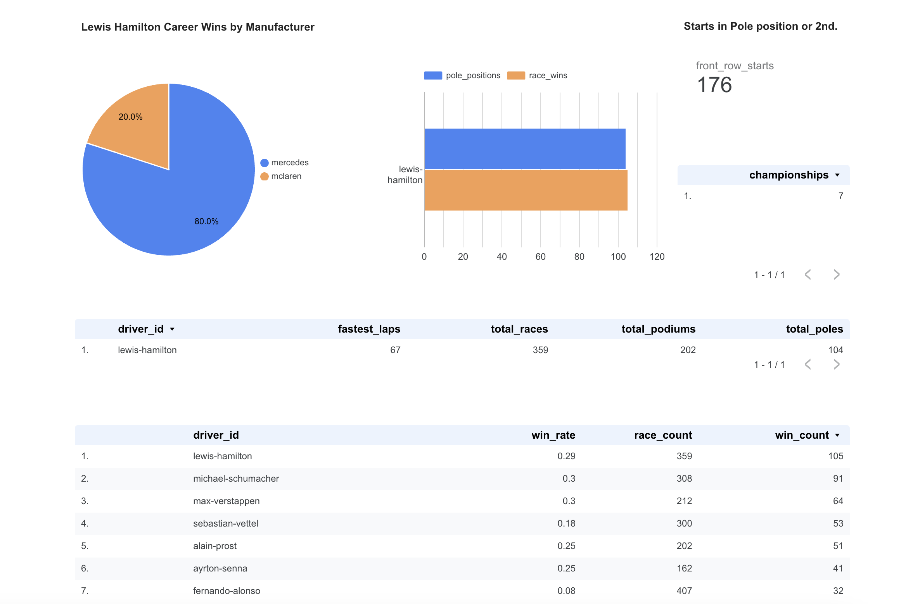

# lewis-hamilton-brilliance
Data Engineering Zoomcamp Capstone Project: The Brilliance of Lewis Hamilton in Data


# Problem
#### The Brilliance of Lewis Hamilton
Lewis Hamilton isn’t just a Formula 1 driver—he’s a once-in-a-generation athlete whose dominance has redefined greatness in the sport. With seven world championships, a record-breaking number of wins, poles, and podiums, his career is a data-rich case study in sustained excellence.

But the narrative around "the greatest of all time" in F1 is often subjective—tied up in eras, team dynamics, or fan loyalty. This project sets out to explore that question through data. Using the open [F1DB dataset](https://github.com/f1db/f1db), we’ll build a cloud-based data pipeline that ingests, transforms, and visualizes Hamilton’s career in context with the rest of the grid—past and present.

We’re not here just to admire the stats—we’re here to prove the brilliance with data. We'll answer questions like:

1. How many races has Lewis Hamilton competed in—and how does his win rate compare to other drivers with long careers?

1. How often has he started from pole or the front row?

1. How many wins did he earn for each manufacturer?

1. Who are the all-time greats in terms of total wins, poles, and championships—and where does Lewis stand?


# Running the Project End-to-End
If you're following along we’ll be using GCP, Terraform, BigQuery, dbt, and Looker to create an end-to-end pipeline that answers these questions and makes the case for Lewis Hamilton as the GOAT.

#### Prerequisites
- Google Cloud Project with:
   - Compute Engine virtual machine
   - BigQuery
   - Cloud Storage
   - Service Account JSON keys 
      - BigQuery Admin, BigQuery Data Editor, BigQuery User, Compute Admin, Project IAM Admin, Storage Admin, Storage Object Admin

- A `.env` file in the project root

- Terraform installed (used to provision BigQuery datasets and GCS buckets)

- A python environment preferably Anaconda

### Step 0: Project setup
This project assumes you can ssh into a remote machine at GCP, and that you in your remote environment you already have Terraform, Docker, and Anaconda3 installed just like the environment setup in the [2025 Data Engineering Zoomcamp](https://github.com/DataTalksClub/data-engineering-zoomcamp/blob/main/01-docker-terraform/README.md). 

- Open your terminal
- Git clone the repo:
   ```bash
   git clone git@github.com:brukeg/lewis-hamilton-brilliance.git
   ```
- Change directory into the project:
   ```bash
   cd lewis-hamilton-brilliance/
   ```
- Ensure you have the python package, Click, in your environment (it's included with Anaconda3)
   ```bash
   (base) you@ssh-hostname:~/lewis-hamilton-brilliance$ pip show click
      Name: click
      Version: 8.1.8
      Summary: Composable command line interface toolkit
      Home-page:
      Author:
      Author-email:
      License:
      Location: /home/you/anaconda3/lib/python3.12/site-packages
      Requires:
      Required-by: black, conda_index, cookiecutter, dask, distributed, faust, Flask, mycli, nltk, pgcli, pgspecial, streamlit
   ```
If you don't have Click you may need to create and activate a virtual environment in the root of the project folder. After you do that you can run:
   `pip install -r requirements.txt`
- Create a `.env` file at the project root:
   ```bash
   (base) you@ssh-hostname:~/lewis-hamilton-brilliance$ touch .env
   ```

- Now open your `.env` file in any editor and save these details:

   ```
   GOOGLE_CREDENTIALS_HOST=/path/to/your/gcp/service_account_keys.json
   GOOGLE_APPLICATION_CREDENTIALS=/secrets/creds.json
   F1DB_RELEASE_URL=https://github.com/f1db/f1db/releases/download/v2025.3.0/f1db-csv.zip
   RAW_DATA_DIR=/app/data/raw
   GCS_BUCKET=your-gcp-bucket-name-data-lake # details below
   GCS_PREFIX=raw/latest
   ```

**NOTE:**
You'll get the GCS_BUCKET value after you do `terraform apply` below. 

Update `GOOGLE_CREDENTIALS_HOST` with your service account json keys, and be sure to have these enabled (BigQuery Admin, BigQuery Data Editor, BigQuery User, Compute Admin, Project IAM Admin, Storage Admin, Storage Object Admin). `GOOGLE_APPLICATION_CREDENTIALS`, `F1DB_RELEASE_URL`, `RAW_DATA_DIR`, and `GCS_PREFIX` all stay as they are.

- Initiate Docker:
   ```bash
   (base) you@de-zoomcamp:~/lewis-hamilton-brilliance$ docker compose up -d --build
   ```

   You can double check that all the containers were built and running properly with `docker ps`

   ```bash
   (base) you@ssh-host:~/lewis-hamilton-brilliance$ docker ps
   CONTAINER ID   IMAGE                                 COMMAND                  CREATED         STATUS                            PORTS                                       NAMES
   1f5b620d4292   kestra/kestra:latest                  "/bin/sh -c 'while t…"   6 seconds ago   Up 4 seconds                                                                  kestra-cli
   209f340063e0   google/cloud-sdk:slim                 "/bin/sh -c 'gcloud …"   6 seconds ago   Up 4 seconds                                                                  gcloud
   107d7816b4e2   lewis-hamilton-brilliance-kestra      "docker-entrypoint.s…"   6 seconds ago   Up 4 seconds                      0.0.0.0:8080->8080/tcp, :::8080->8080/tcp   kestra
   0e34e74c2fee   lewis-hamilton-brilliance-dbt         "/bin/sh -c 'tail -f…"   6 seconds ago   Up 4 seconds (health: starting)                                               dbt
   2a81f77482d0   lewis-hamilton-brilliance-terraform   "/bin/sh -c 'tail -f…"   6 seconds ago   Up 4 seconds                                                                  terraform
   555fbb51483b   lewis-hamilton-brilliance-ingestion   "/bin/sh -c 'tail -f…"   6 seconds ago   Up 4 seconds                                                                  ingestion
   ```

### Step 1: Provision Infrastructure with Terraform
From the root of the project change directory into `terraform/ ` then apply the resources.

   ```bash
   (base) you@ssh-host:~/lewis-hamilton-brilliance$ cd terraform/
   (base) you@ssh-host:~/lewis-hamilton-brilliance/terraform$ terraform init
   ...
   (base) you@ssh-host:~/lewis-hamilton-brilliance/terraform$ terraform plan
   ...
   (base) you@ssh-host:~/lewis-hamilton-brilliance/terraform$ terraform apply
   ...
   ```

**This creates:**
- A GCS bucket for the data lake. You can copy/paste the name of this bucket from the GCP console to your `.env` file `GCS_BUCKET` variable.
- BigQuery datasets: dbt_staging, semi_processed, final_transformed

You can verify that these have been created from the Google Cloud Platform Console before moving on.

### Step 2: Ingest Raw Data
If you're still in the `lewis-hamilton-brilliance/terraform/` directory then change back to the project root with `cd ..`. 

From the project root:
   ```bash
   python race_cli.py ingest
   ```

This will:
   - Download the latest F1DB dataset 
   - Extract all CSVs
   - Upload them to the `raw/latest/` directory of the GCS bucket which Terraform provisioned.

### Step 3: Transform with dbt

From the project root:
```bash
python race_cli.py transform run_pipeline
```
This runs the full full DBT pipeline and each of the three schemas: dev -> semi -> final.

You can execute individual transformations steps as well:
```bash
# Materialize external + raw tables
python race_cli.py transform --target dev

# Build intermediate tables
python race_cli.py transform --target semi

# Build final, filtered Lewis Hamilton–specific tables
python race_cli.py transform --target final
```


# project structure
```
lewis-hamilton-career-brilliance/
.
├── dags/                        # Orchestration logic
│   └── workflows/               # YAML-based Kestra workflow definitions
│
├── data/                        # Local data lake storage
│   ├── raw/                     # Unzipped CSVs from latest F1DB release
│   ├── processed/               # Semi-transformed intermediate data (e.g. dbt staging models)
│   └── final/                   # Finalized data (e.g. dbt marts filtered for Lewis Hamilton)
│
├── dbt/                         # dbt project for modeling and transformation
│   ├── dbt_packages/            # Folder for dbt package dependencies
│   ├── logs/                    # dbt execution logs (useful for debugging and CI)
│   ├── macros/                  # Custom Jinja/SQL macros used across dbt models
│   ├── models/                  # dbt models (staging, marts, lewis_hamilton subfolders expected)
│   └── target/                  # Compiled SQL and artifacts from dbt runs (excluded from version control)
│
├── docker/                      # Docker configuration files
│   ├── dbt/                     # Dockerfile and setup for dbt container
│   ├── ingestion/               # Dockerfile and setup for ingestion container
│   ├── kestra/                  # Dockerfile for Kestra UI/engine container
│   └── terraform/               # Dockerfile and setup for running Terraform in a container
│
├── ingestion/                   # Ingestion logic and CLI
│   ├── main.py                  # Container-level CLI entrypoint to trigger ingestion logic
│   ├── manage_raw_data.py       # Main ingestion workflow logic (version checking, uploading to GCS)
│   ├── extract_data.py          # Downloads and extracts F1DB zip release
│   └── upload_to_gcs.py         # Uploads local files to GCS under configured prefix
│
├── terraform/                   # Infrastructure-as-code for GCP
│   ├── main.tf                  # Defines storage, IAM, BigQuery datasets/tables
│   ├── variables.tf             # Parameterized inputs (e.g., project ID, bucket name)
│   └── outputs.tf               # (Optional) Outputs used across environments or workflows
│
├── tests/                       # Unit and integration tests (for dbt, ingestion, etc.)
```

# Ingestion

The ingestion pipeline is responsible for downloading, extracting, and uploading F1DB CSV data to Google Cloud Storage (GCS). It also manages the local storage of raw data by retaining only the latest release to conserve disk space and control GCS costs.

## Overview

1. **Download and Extract Data:**  
   - The `ingestion/extract_data.py` script downloads the ZIP file from the F1DB release URL and saves it to a local directory.
   - It then extracts the ZIP file, placing the CSV files in the designated raw data directory (e.g., `data/raw/`).

2. **Version Management and Data Refresh:**  
   - The `ingestion/manage_raw_data.py` script orchestrates the ingestion process.
   - It parses the release version from the ZIP file URL (using a CalVer scheme like `2025.3.0`).
   - The script compares the new version with a locally stored version (kept in a `version.txt` file within the raw data directory).
   - If the new version is detected, the script clears the local raw data directory, updates it with the new data, and uploads the latest data to GCS under a specified prefix (e.g., `raw/latest/`).

3. **Uploading Data to GCS:**  
   - The `ingestion/upload_to_gcs.py` script handles recursively uploading the contents of the local raw data directory to a GCS bucket.
   - This ensures that only the latest data is persisted in the cloud.


# Transformation

The dbt transformation layer handles structuring the raw F1DB data into progressively cleaner, more analysis-friendly datasets. This is done using a Medallion Architecture: raw data lives in `dbt_staging`, `semi-processed` where models are built from, and final outputs used for analysis live in `final_transformed`.

## Overview
1. **Raw Data Externalization and Materialization:**

- The raw CSV files uploaded to GCS are exposed in dbt via the dbt_external_tables package.

- Each CSV file is defined as an external table in `models/raw/external/` and linked in the sources: section of `raw/schema.yml`.

- These external tables are then optionally materialized as native BigQuery tables in `models/raw/materialized/`, providing a stable interface for downstream transformations.

2. **Semi-Processed Layer (Intermediate Models):**

- The `semi_processed/` directory is where general-purpose transformations live — such as per-driver aggregations, race-level summaries, or win stats by constructor.

- Each model in this layer includes `{{ config(schema='semi_processed') }}` or is selectively enabled via the --target system using +enabled flags in `dbt_project.yml`.

- This layer is built using standard dbt modeling best practices: incremental logic where needed, clear naming conventions, and a focus on wide usability across final models.

3. **Final Transformed Layer (Analysis-Ready Models):**

- Final models in `final_transformed/` are narrowly scoped for the specific analysis I'm doing on Lewis Hamilton’s career.

- Instead of using `ref()` to pull from other dbt models (which would require all dependencies to be enabled at runtime), these models use `source()` to pull from pre-built tables in the semi_processed dataset.

- This allows each layer (dev, semi, final) to be built independently, using different `--target` profiles that map to different BigQuery datasets.

4. **Isolated Targets for Clear Boundaries:**

- The profiles.yml file defines three separate targets:

  - dev → writes to dbt_staging

  - semi → writes to semi_processed

  - final → writes to final_transformed

- Each directory in the dbt project is only enabled for the relevant target using +enabled: `"{{ target.name == 'X' }}"`, which ensures clean separation of concerns and reproducibility across transformation stages.


# Click CLI
The Click-based CLI makess running the projet a breeze by allowing for ingestion and transformation steps via easy-to-use terminal commands.

## Overview
The CLI wraps the project’s core functionality into a simple interface. It’s implemented using Click, a Python library for building command-line tools. You can run each part of the pipeline from your terminal using subcommands like `ingest` and `transform`.

Basic structure of a Click command:
```bash
python race_cli.py <command> [OPTIONS]
```

## Commands

### Ingest: 
`python cli.py ingest`
Downloads raw F1DB data, extracts files, and uploads them to GCS. Calls `manage_raw_data.py` which handles downloading the zip from GitHub, extracting contents, and pushing `.csv` files into the raw/latest directory of your GCS bucket (`gs://<your-bucket>/raw/latest/`).

   Example:
   ```bash
   python main.py ingest
   ```

The Ingest command will detect if the version of the file in `F1DB_RELEASE_URL` is the same or older than the current version (if one), versions that are not new will not be ingested, however you can bypass this functionality and force the ingest to occur with the optional `-f` or `--force` commands.
   ```bash
   python race_cli.py ingest -f
   ```

   ```bash
   python race_cli.py ingest --force
   ```

### Transform: 
`python race_cli.py transform --target [dev|semi|final]`
Runs dbt transformations for a specific target stage (dev, semi, or final). Optionally, you can limit execution to specific models or tags using `--select`.
   ```bash
   python race_cli.py transform --target <TARGET> [--select <MODEL_OR_TAG>]
   ```
   - `--target`: Required. The dbt target to run.
   - `--select`: Optional. Specify one or more dbt models or tags to run selectively.

Examples:
   ```bash
   python race_cli.py transform --target dev
   python race_cli.py transform --target final --select +driver_standings
   ```

#### Run pipeline: 
`python race_cli.py run-pipeline`
Executes the full dbt pipeline and all dbt transformation stages (dev, semi, and final) in order.

Example:
   ```bash
   python race_cli.py run_pipeline
   ```

# Charts
location: https://lookerstudio.google.com/u/0/reporting/02687b3a-ccf4-4618-bb55-02aa4f842524/page/MT0GF

